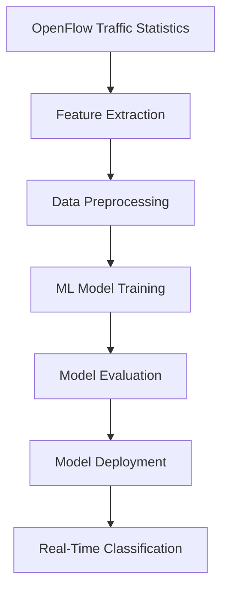

# 🚀 Real-Time AI-Powered Traffic Classification for Software-Defined Networks (SDN)

<p align="center">
<b>
An AI-driven Software-Defined Networking framework for real-time traffic classification, intelligent QoS enforcement, and privacy-preserving network intelligence.
</b>
</p>

<p align="center">


</p>

---

# 📖 Overview

Modern networks support increasingly dynamic and bandwidth-intensive applications such as video streaming, online gaming, VoIP communication, and cloud services.

Traditional traffic classification approaches have several limitations:

- **Port-based classification** can easily be bypassed by modern applications.
- **Deep Packet Inspection (DPI)** introduces privacy concerns and struggles with encrypted traffic.

This project introduces a **Real-Time AI-Powered Traffic Classification Framework for Software-Defined Networks (SDN)** that uses **machine learning models and statistical flow features** to identify network traffic without inspecting packet payloads.

The system integrates:

- Software-Defined Networking
- OpenFlow-based traffic monitoring
- Machine Learning classification
- Automatic Quality of Service (QoS) enforcement
- Real-time monitoring dashboard

The result is an intelligent network management system capable of understanding traffic behavior while preserving user privacy.

---

# 🎯 Key Objectives

The project aims to:

1. Collect real-time flow statistics from SDN switches.
2. Extract meaningful statistical traffic features.
3. Classify network applications using Machine Learning.
4. Automatically apply QoS policies based on traffic importance.
5. Provide real-time visualization and monitoring.
6. Maintain reliability through fault-tolerant system design.

---

# ✨ Key Capabilities

## 🔒 Privacy-Preserving Traffic Classification

Unlike DPI-based systems, this framework does not inspect packet payload content.

Instead, it analyzes:

- Packet statistics
- Byte statistics
- Flow duration
- Packet rates
- Traffic behavior patterns

This enables classification even when traffic is encrypted.

---

## ⚡ Real-Time Classification

The system provides:

- Continuous flow monitoring
- Machine learning inference
- Automatic traffic identification
- Real-time dashboard updates

Average classification latency:

```
< 100 ms
```

---

## 🤖 AI-Based Intelligence

The framework evaluates multiple machine learning models:

- Random Forest
- K-Nearest Neighbor (KNN)
- Support Vector Machine (SVM)
- Logistic Regression
- Gaussian Naive Bayes
- K-Means

Best performing model:

```
Random Forest
```

Performance:

```
Accuracy: 96.8%
```

---

## 🚦 Automatic QoS Enforcement

The system dynamically applies network policies based on detected traffic categories.

Examples:

- Prioritize Voice and Video traffic
- Maintain interactive application performance
- Control bulk transfer traffic

---

# 🌐 Supported Traffic Classes

The system identifies the following traffic categories:

| Traffic Type | Description |
|---|---|
| DNS | Domain Name Resolution |
| HTTP | Web Traffic |
| HTTPS | Secure Web Traffic |
| FTP | File Transfer |
| SSH | Secure Remote Access |
| Telnet | Remote Terminal |
| Voice | VoIP Communication |
| Video | Streaming Applications |
| Game | Online Gaming |
| Ping | ICMP Traffic |

---

# 🏗️ System Architecture

The framework follows the Software-Defined Networking architecture model.

```
┌───────────────────────────────────────────────┐
│              Web Dashboard                    │
│       Flask + WebSocket + Chart.js            │
│              Port: 9000                       │
└───────────────────────┬───────────────────────┘
                        │
                        │ Real-Time Updates
                        │
┌───────────────────────▼───────────────────────┐
│           AI Traffic Classifier               │
│              Ryu Controller                   │
│                                               │
│ ┌──────────────┐ ┌──────────────┐             │
│ │ Flow Manager │ │ Feature      │             │
│ │              │ │ Extractor    │             │
│ └──────┬───────┘ └──────┬───────┘             │
│        │                │                     │
│        └────────┬───────┘                     │
│                 ▼                             │
│        ┌──────────────┐                       │
│        │ ML Model     │                       │
│        │ Manager      │                       │
│        └──────────────┘                       │
│                                               │
│ ┌──────────────┐ ┌──────────────┐             │
│ │ QoS Manager  │ │ Health       │             │
│ │              │ │ Monitor      │             │
│ └──────────────┘ └──────────────┘             │
└───────────────────────┬───────────────────────┘
                        │
                        │ OpenFlow Protocol
                        │
┌───────────────────────▼───────────────────────┐
│              Mininet Network                  │
│                                               │
│        Open vSwitch (OVS)                     │
│                                               │
│     h1 -------- s1 -------- h2                │
│                    │                          │
│                    h3                         │
└───────────────────────────────────────────────┘
```

---

# 🧩 Architecture Components

| Component | Responsibility | Technology |
|---|---|---|
| Flow Manager | Tracks network flows | Python |
| Feature Extractor | Generates statistical features | NumPy |
| ML Model Manager | Performs classification | Scikit-learn |
| QoS Manager | Applies traffic policies | OpenFlow |
| Health Monitor | System monitoring | psutil |
| Dashboard | Real-time visualization | Flask + WebSocket |

---

# 🛠️ Technology Stack

## SDN Infrastructure

- Ryu SDN Controller 4.34+
- OpenFlow Protocol
- Mininet 2.3+
- Open vSwitch 2.13+

## Artificial Intelligence

- Python
- Scikit-learn
- NumPy
- Pandas

## Backend & Dashboard

- Flask
- Flask-SocketIO
- Chart.js
- WebSocket

## Deployment & Engineering

- Docker
- docker-compose
- pytest
- GitHub Actions
- Black
- Flake8
- MyPy

---
# 🧠 Machine Learning Pipeline

The system uses a complete machine learning workflow to transform raw network flow statistics into intelligent traffic classifications.



---

# 📊 Feature Engineering

The classifier uses **16 statistical flow features** instead of packet payload inspection.

This approach improves privacy and allows classification of encrypted traffic.

## Extracted Features

Examples include:

| Feature Category | Examples |
|---|---|
| Packet Statistics | Packets/sec, packet count |
| Byte Statistics | Bytes/sec, total bytes |
| Flow Duration | Connection duration |
| Forward Traffic | Forward packet rate |
| Reverse Traffic | Reverse packet rate |
| Timing Behavior | Mean inter-arrival time |
| Flow Behavior | Bidirectional traffic patterns |

---

# 🤖 Machine Learning Models

Multiple models were evaluated to identify the best balance between accuracy and performance.

| Model | Purpose |
|---|---|
| Random Forest | Final selected classifier |
| KNN | Distance-based classification |
| SVM | Margin-based classification |
| Logistic Regression | Linear baseline |
| Gaussian Naive Bayes | Probabilistic model |
| K-Means | Unsupervised comparison |

## Final Model

The Random Forest classifier achieved the best overall performance.

Performance:

| Metric | Result |
|---|---|
| Accuracy | 96.8% |
| Average Latency | 45 ms |
| Throughput | 1,500 flows/sec |

---

# 🚦 Intelligent QoS Policy Mapping

After classification, the system automatically applies QoS policies.

| Traffic Category | Priority Level | DSCP Class |
|---|---|---|
| Voice | Priority 5 | EF |
| Video Streaming | Priority 5 | EF |
| Gaming | Priority 4 | AF41 |
| SSH | Priority 3 | AF41 |
| HTTP/HTTPS | Priority 2 | Best Effort |
| FTP | Priority 1 | Bulk |

This enables the SDN controller to dynamically optimize network performance.

---

# 🛡️ Fault Tolerance & Reliability

The system is designed for continuous operation using reliability mechanisms.

## Circuit Breaker Pattern

The ML inference layer includes a circuit breaker mechanism.

Workflow:

```
Normal Operation

        ↓

ML Prediction Failure

        ↓

Failure Counter Increased

        ↓

Multiple Failures Detected

        ↓

Circuit Breaker Activated

        ↓

Fallback Rule-Based Classification
```

---

## Reliability Features

✅ Model validation before execution  
✅ Health monitoring  
✅ SDN connection monitoring  
✅ Automatic recovery mechanisms  
✅ Graceful degradation  
✅ Structured logging  

---

# 📊 Real-Time Monitoring Dashboard

The system provides a web-based dashboard for network operators.

## Dashboard Features

- Live flow monitoring table
- Traffic distribution visualization
- System health monitoring
- Resource usage metrics
- Latency tracking
- Throughput monitoring

## Dashboard Technology

- Flask
- Flask-SocketIO
- WebSocket
- Chart.js

---

# 📦 Project Structure

```
Traffic-classifier-SDN/

│
├── controller/
│   ├── Ryu SDN applications
│   ├── Flow manager
│   ├── QoS manager
│   └── ML integration
│
├── dashboard/
│   ├── Flask application
│   ├── WebSocket server
│   └── Visualization
│
├── models/
│   ├── Trained classifiers
│   └── Model configurations
│
├── features/
│   └── Feature extraction logic
│
├── tests/
│   ├── Unit tests
│   ├── Integration tests
│   └── System tests
│
├── docker/
│   └── Container configuration
│
└── README.md
```

---

# ⚙️ Installation Guide

## System Requirements

Recommended:

| Requirement | Specification |
|---|---|
| Operating System | Ubuntu 20.04+ / WSL2 |
| CPU | 4+ cores |
| RAM | 8GB minimum |
| Storage | 10GB free space |

---

# 1. Clone Repository

```bash
git clone https://github.com/Kidus-kida/Traffic-classifier-SDN.git

cd Traffic-classifier-SDN
```

---

# 2. Install Python Dependencies

```bash
pip install -r requirements.txt
```

---

# 3. Start SDN Controller

Run Ryu Controller:

```bash
ryu-manager controller/main.py
```

---

# 4. Start Mininet Network

Example:

```bash
sudo mn \
--topo single,3 \
--controller remote \
--switch ovsk
```

---

# 5. Start Dashboard

```bash
python dashboard/app.py
```

Dashboard:

```
http://localhost:9000
```

---

# 🐳 Docker Deployment

The system supports containerized deployment.

Build containers:

```bash
docker-compose build
```

Start services:

```bash
docker-compose up
```

Available services:

- SDN Controller
- Dashboard
- Monitoring Services

---

# 🧪 Testing

The project includes automated testing.

Testing tools:

- pytest
- Unit testing
- Integration testing
- System testing

Test coverage:

```
88.7%
```

Run tests:

```bash
pytest
```

---

# 📈 Experimental Results

The system was evaluated under continuous operation.

## Performance Summary

| Metric | Result |
|---|---|
| Classification Accuracy | 96.8% |
| Average End-to-End Latency | 45 ms |
| Processing Throughput | 1,500 flows/sec |
| Test Coverage | 88.7% |
| Stress Test | 24 hours continuous operation |

The system completed a 24-hour stress test without memory leaks.

---

# 🔐 Privacy Advantages

Compared with DPI-based approaches:

| Traditional DPI | Proposed System |
|---|---|
| Inspects payload data | Uses statistical features |
| Privacy concerns | Privacy-preserving |
| Poor encrypted traffic support | Works with encrypted traffic |
| High processing overhead | Lightweight classification |

---

# 🚀 Future Improvements

Planned improvements include:

- Deep Learning models (RNN/LSTM)
- Temporal traffic analysis
- Real hardware switch deployment
- Kubernetes-based scaling
- 5G network validation
- Automated SDN policy optimization
- Federated learning for privacy enhancement

---

# 📚 Citation

If you use this project for academic or research purposes, please cite:

```
Kidus Yared.
Real-Time AI-Powered Traffic Classification for Software-Defined Networks.
AI + SDN Traffic Intelligence Framework.
```

---

# 📜 License

This project is licensed under the MIT License.

---

# 📬 Connect With Me

<p align="left">

<a href="mailto:kidusyared005@gmail.com">

</a>

<a href="https://www.linkedin.com/in/kidus-yared-3ab306412">

</a>

</p>

---

⭐ If you find this project useful, consider giving it a star.
