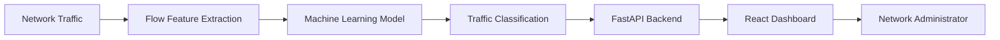
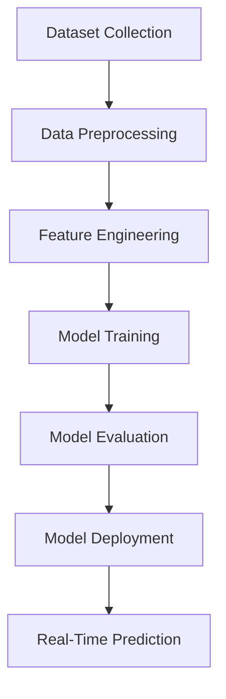

# 🚀 Real-Time AI Traffic Classification for Software-Defined Networks (SDN)

<p align="center">
  <b>
  An AI-powered, privacy-preserving network traffic classification system for Software-Defined Networks using Machine Learning, FastAPI, and React.
  </b>
</p>

<p align="center">


</p>

---

# 📖 Overview

Modern networks generate massive amounts of traffic that require intelligent classification for efficient management, monitoring, and Quality of Service (QoS) optimization.

Traditional traffic classification approaches often depend on **Deep Packet Inspection (DPI)**, which introduces privacy concerns, higher computational overhead, and limitations when analyzing encrypted traffic.

This project presents an **AI-powered traffic classification system for Software-Defined Networks (SDN)** that uses **Machine Learning models and statistical network flow features** to identify traffic patterns without inspecting packet payloads.

The system provides real-time traffic analysis through a **FastAPI backend** and an interactive **React dashboard**, allowing network operators to monitor and understand network behavior.

---

# 🎯 Project Goals

- Develop an intelligent traffic classification system for SDN environments
- Apply Machine Learning for automated traffic identification
- Preserve user privacy by avoiding packet payload inspection
- Provide real-time prediction through an API
- Visualize traffic classification results through a web dashboard

---

# ✨ Key Features

## 🤖 Machine Learning Classification

- ML-based network traffic classification
- Statistical flow feature analysis
- Automated traffic pattern recognition
- Model-based prediction pipeline

---

## 🌐 Software-Defined Networking Support

- Designed for SDN environments
- Enables intelligent traffic monitoring
- Supports future QoS automation
- Helps network administrators understand traffic behavior

---

## ⚡ Real-Time Prediction

- FastAPI REST API inference service
- Low-latency classification workflow
- Real-time dashboard visualization

---

## 🔒 Privacy-Preserving Approach

Unlike Deep Packet Inspection (DPI), this system:

- Does not inspect user payload data
- Uses network flow characteristics
- Works with encrypted traffic scenarios
- Reduces privacy risks

---

# 🏗️ System Architecture



---

# 🔄 System Workflow

```text
Network Traffic

        ↓

Traffic Flow Collection

        ↓

Feature Extraction

        ↓

Machine Learning Classification

        ↓

FastAPI Prediction API

        ↓

React Monitoring Dashboard

        ↓

Network Decision Making
```

---

# 🧠 Machine Learning Pipeline



---

# 🛠️ Technology Stack

## Artificial Intelligence

- Python
- Scikit-learn
- Pandas
- NumPy

## Backend

- FastAPI
- Uvicorn
- REST API

## Frontend

- React.js
- JavaScript
- HTML5
- CSS3

## Networking

- Software-Defined Networking (SDN)
- Network Flow Analysis

## Development Tools

- Git
- GitHub
- Postman

---

# 📂 Project Structure

```text
Traffic-classifier-SDN/

│
├── backend/
│   ├── API implementation
│   ├── Model loading
│   └── Prediction services
│
├── frontend/
│   ├── React dashboard
│   ├── Components
│   └── User interface
│
├── model/
│   └── Trained machine learning models
│
├── dataset/
│   └── Training and testing data
│
├── notebooks/
│   └── Data analysis and experiments
│
└── README.md
```

---

# 📊 Model Performance

> Replace the values below with your actual evaluation results.

| Metric | Result |
|---|---|
| Accuracy | Add Result |
| Precision | Add Result |
| Recall | Add Result |
| F1 Score | Add Result |
| Prediction Latency | Add Result |

---

# 📡 API Documentation

## Traffic Classification Endpoint

### Request

```http
POST /predict
```

Example:

```json
{
  "flow_duration": 120,
  "packet_count": 350,
  "byte_count": 45000,
  "protocol": "TCP"
}
```

---

### Response

```json
{
  "prediction": "Traffic Category",
  "confidence": 0.95
}
```

---

# ⚙️ Installation Guide

## 1. Clone Repository

```bash
git clone https://github.com/Kidus-kida/Traffic-classifier-SDN.git

cd Traffic-classifier-SDN
```

---

# Backend Setup

Navigate to backend:

```bash
cd backend
```

Install dependencies:

```bash
pip install -r requirements.txt
```

Run FastAPI server:

```bash
uvicorn main:app --reload
```

Backend will run:

```
http://localhost:8000
```

---

# Frontend Setup

Navigate to frontend:

```bash
cd frontend
```

Install packages:

```bash
npm install
```

Start application:

```bash
npm run dev
```

---

# 📷 Screenshots

Add screenshots:

- Dashboard interface
- Traffic prediction results
- API responses
- Model evaluation results

Example:

```
docs/
 ├── dashboard.png
 ├── prediction.png
 └── architecture.png
```

---

# 🔐 Security & Privacy

The system follows a privacy-preserving approach by avoiding packet payload inspection.

Benefits:

✅ No user content inspection  
✅ Reduced privacy risks  
✅ Suitable for encrypted traffic environments  
✅ Efficient network analysis  

---

# 🚀 Future Improvements

- Deep Learning-based traffic classification
- Online model retraining
- Docker containerization
- Kubernetes deployment
- SDN controller integration
- Automated QoS policy enforcement
- Cloud-based monitoring

---

# 🤝 Contributing

Contributions are welcome.

Steps:

1. Fork the repository
2. Create a feature branch

```bash
git checkout -b feature/new-feature
```

3. Commit changes

```bash
git commit -m "Add new feature"
```

4. Push changes

```bash
git push origin feature/new-feature
```

5. Create a Pull Request

---

# 📜 License

This project is licensed under the MIT License.

---

# 📬 Connect With Me

<p align="left">

<a href="mailto:kidusyared005@gmail.com">

</a>

<a href="https://www.linkedin.com/in/kidus-yared-3ab306412">

</a>

</p>

---

⭐ If you find this project useful, consider giving it a star.
